## Introduction
In this lab, a time-multiplexer was programmed onto the E155 iCE40 UltraPlus FPGA board with SystemVerilog to control two independent seven-segment displays connected to the same GPIO pins. The displays were capable of showcasing each of the sixteen hexadecimal digits (0-F), and their sum was represented by five external LEDs. This lab introduces a new form of multiplexing and emphasizes the ability to control multiple components with a limited number of available GPIO connections.

## Design and Testing
The independent seven-segment displays were controlled with two four-input DIP switches, which acted as the inputs to the time multiplexer. A clock frequency was generated with the 24 MHz internal high-speed oscillator, which employed an eighteen-bit counter to divide it to a reasonable frequency. This frequency was tailored to prevent bleeding and flickering within the displays while still allowing them to appear simultaneously. With a small degree of trial and error, a frequency of 120 Hz was found to satisfy these display conditions. The 120 Hz modified clock frequency acted as the enable to the multiplexer: when the clock enable was low, it would pass the input logic from the DIP switch controlling the first display, and when high, it would pass the logic from the DIP switch controlling the second. Two PNP transistors behaved as gates that controlled when each display received power: the emitter pins received 3.3 V supplied by the FPGA, the base pins were connected to the GPIO pins on the FPGA with a 1 kOhm resistor in wired in series, and the collector pins were connected to the common anodes on the seven-segment displays.  

The seven-segment displays shared a common layout, meaning that the pins the controlling corresponding segments were connected to the same GPIOs with a 470 kOhm resistor wired in series with them. These resistors not only limited the current running through each segment, but also protected the FPGA pins which acted as a ground. The two four-input DIP switches also controlled five external green LEDs implemented on the breadboard design. The five LEDs received power from five separate GPIO pins on the FPGA and were wired in series with 200 Ohm resistors to limit their current draw. The LEDs illuminated to showcase the binary sum of the DIP switch positions, and by extension, the sum of the two hexadecimal digits shown on the seven-segment displays.  

Calculations for resistor connected to the base pins of the PNP transistors are shown in Figure 1, while the calculations to limit the current draw of the seven-segment displays and the external LEDs can be found in Figures 2 and 3, respectively. 

The source code for this lab can be found at this [Github Repository.]()

## Calculations

The seven-segment displays are composed of deep red diodes with a forward voltage of 2 V. These diodes exhibit sufficient birghtness when receiving a current between 1-10 mA. To preserve the functionality of the FPGA's GPIO pins, a sink current above 8 mA is not advisable. Therefore, a resistor controlling the current between 1 and 5 mA was desired. The calculations for the seven-segment resistor values are shown in Figure 2 below.

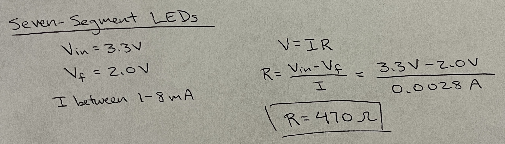

The five external LEDs were green, meaning they each had a voltage drop of around 1.8 V. Sufficient luminescence is obtained with a current of around 7-10 mA. Understanding that the input voltage from the FPGA is 3.3 V, Ohm's Law was used to find the satisfactory resistor value of 200 Ohms. This calculation can be found below in Figure 3.

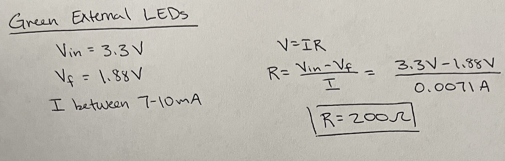

## Technical Documentation
### Block Diagrams
The SystemVerilog code to complete the lab deliverables were separated into three modules: one describing the multiplexer logic, another implementing the seven-segment logic from the DIP switch positions, and a third executing the addition for the external LED display. All modules were called in the comprehensive top module outlined below.

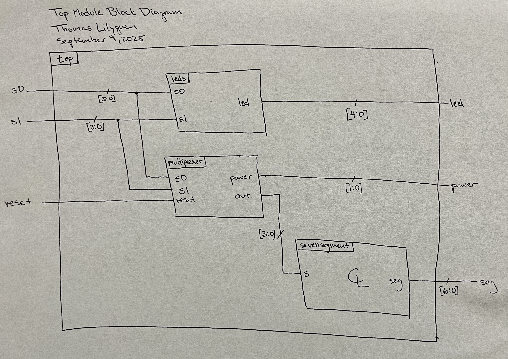

The multiplexer modules instantiates the HSOSC and implements the counter for clock division. Within the module, the enable bit, oscillating at the same frequency as the 120 Hz clock, is fed into a mux established with a ternary operator. The mux receives the two DIP switch inputs, and depending on this enable value, passes one of those two inputs to the output.

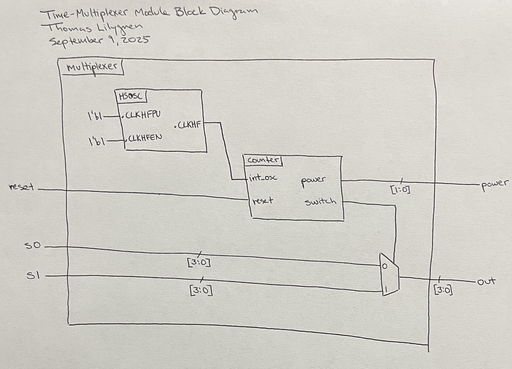

### Electronic Schematics
To ensure all segments are equally illuminated, the segments are wired in parallel to each other, and each is wired in series with a 470 Ohm resistor to limit the current through the display and sunk into the FPGA. The two displays share common pin functions, meaning that counterparts are connected together and fed to the same GPIO.

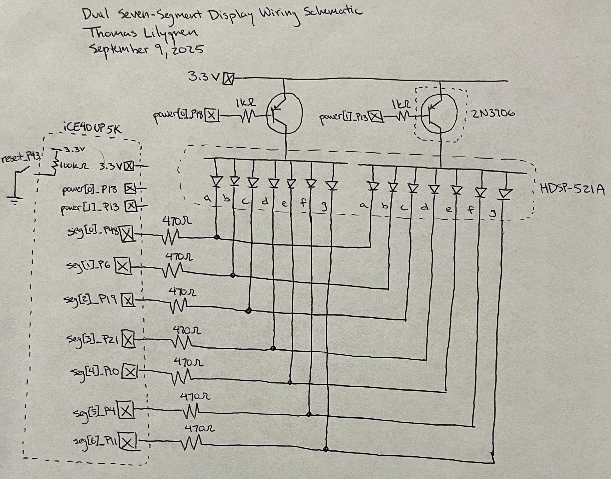

The five green external LEDs are powered with the FPGA based on the summation logic implemented in the leds module. Each diode is wired in series with a 200 Ohm current-limiting resistor and fed to ground. These resistors allow 7 mA of current to flow through each LED, which makes it sufficiently bright when on.

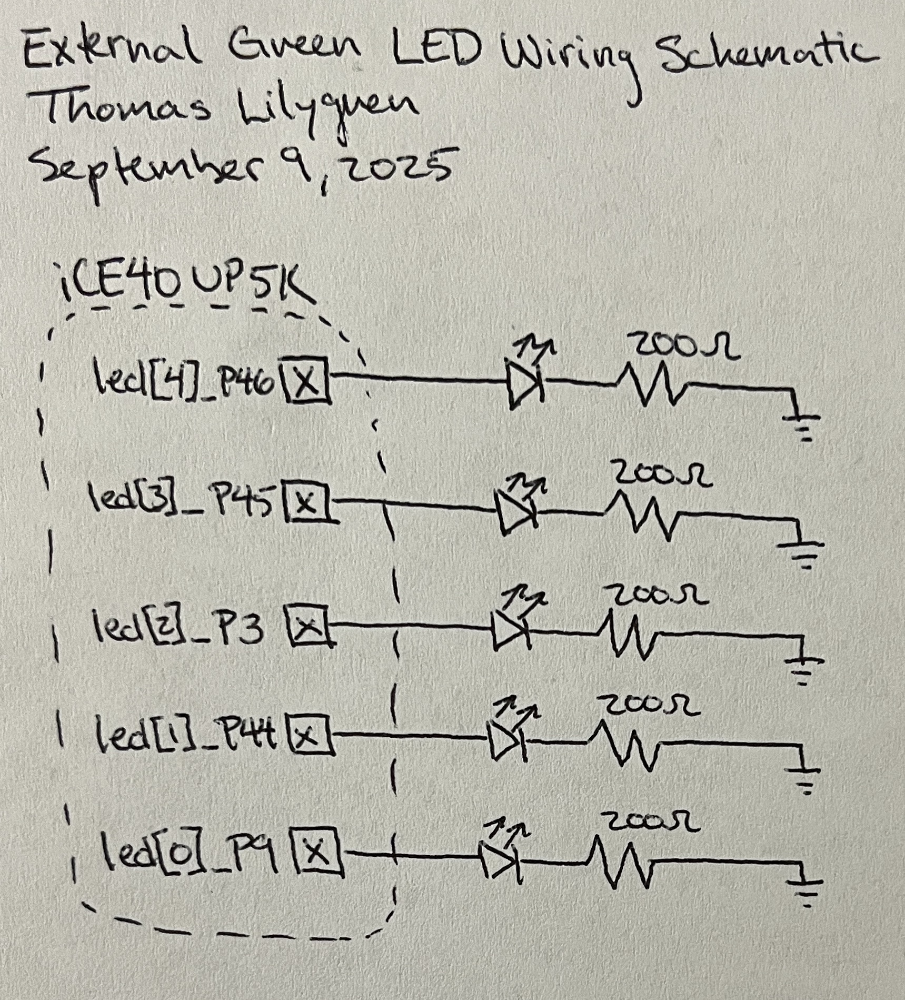

## Results and Discussion
The external LEDs were confirmed to output the proper binary value through a waveform simulation. All possible switch input combinations were tested and the output sum is present in the waveforms in Figure 8. The two DIP switches were powered low, meaning their bits must be inverted before taking their sum.

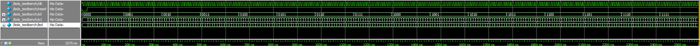

Figure 9 shows a zoomed-in portion of the LED waveforms in Figure 8. This image allows a closer look into the output (led) values at given switch input values.

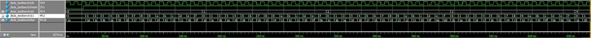

The seven-segment waveforms in Figure 10 are similar to the waveforms showcased in lab 1. Here, the seg outputs and seg_expected outputs are outlined in the same wave signals. Throughout the entire simulation, it is clear that seg is equal to seg_expected, as desired.

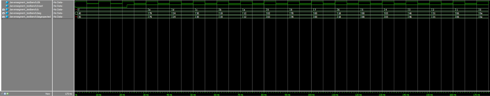

The multiplexer module waveforms in Figure 11 were implemented with a nested for loop and assert statements. The simulation duration was lengthy, but the logic and behavior remains consistent.

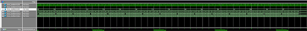{width=100%}

Figure 12, shows a zoomed-in segment of the multiplexer waves in Figure 11. This wave shows that as the multiplexer enable oscillates between zero and one with the modified clock frequency, the output value alternates between the first and second switch values. The nested for loop allows for all possible switch combinations to be tested and confirmed.

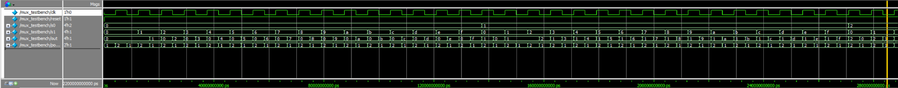

## Conclusion
This simulation waveforms paired with the successful hardware implementation indicate that this lab successfully met all design requirements. The displays successfully employ time-multiplexing, show the independent hexadecimal digits simultaneously, and the LEDs show the proper sum of those digits. In all, this lab took roughly 25 hours to complete.

## AI Prototype
ChatGPT's hardware design for the first lab failed after multiple prompts and updates with Lattice Radiant's error codes. Here, its capabilities are tested again with the following prompt: "Write SystemVerilog HDL to time multiplex a single seven segment decoder (that decodes from four bits to a common anode seven segment display) to decode two sets of input bits and drive two sets of seven output bits."

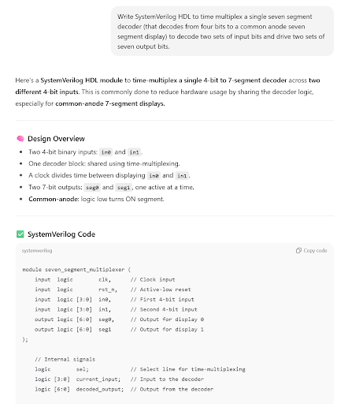

Unlike last, ChatGPT developed hardware code that synthesized in Lattice Radiant on the first try without any reference code from lab 1. It appears that ChatGPT's ability to program hardware is improving. Still, its capabilities will be tested when it has a base script to refer to with the following prompt: "Write SystemVerilog HDL to time multiplex a single seven segment decoder (that decodes from four bits to a common anode seven segment display) to decode two sets of input bits and drive two sets of seven output bits. Use the seven segment decoder and oscillator provided in the attached files."

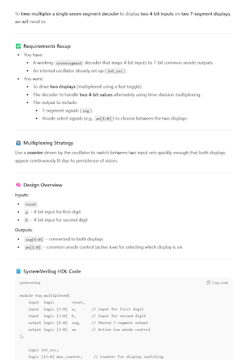

After providing reference code from lab 1, ChatGPT ran into its first error in that it called a seven-segment display module that it did not create. Once prompted to create the seven-segment display module, it copied the code in the module it had been provided and Lattice Synthesized the project without issue.

It is clear that ChatGPT is gaining traction with hardware design and programming whether receiving help with working code or not. Instead of using the ternary operator for a multiplexer, ChatGPT opts for a case statement, which behaves the same, but is less elegant. The AI also uses different instances of variables when calling the seven-segment display module. For example, instead of using "sevensegment display(s, seg)," it uses "sevensegment display(.s(current_intput), .seg(seg))." The code appears to behave the same, but I prefer my implementation over ChatGPT's.